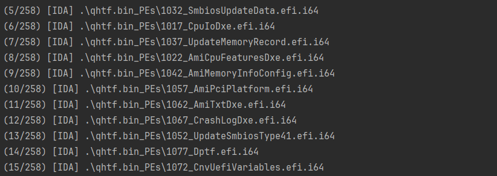

# Batch-IDA

A python library for generate ida pro files in batch mode & compare executable files use bindiff in batch mode.


## Features

1. Fast generate idb/i64 files from binary files in batch mode (Multiprocess supported)
    
2. IDA Pro Plugin Script support
3. Use bindiff to batch compare idb files
4. Roughly read the comparison results

## Requirements

+ Windows environment (i don't know if it works on linux)
+ IDA pro 7 (Only tested on IDA pro 7.7)
+ BinDiff 7 (Optional, used to compare executable files in batch mode)

## Install

```
pip install --upgrade batch-ida
```

## Usage

### BI_IDA

Generate .idb/.i64 files (and run plugin) in batch mode.

```python
from batch_ida import BI_IDA


bi = BI_IDA()
bi.set_ida_path('C:\Tools\IDA Pro')

# optional
bi.set_script(r'.\example_script.py')   # run efiXplore IDA plugin
bi.max_subprocess = 8

bi.batch_idb_fromdir(r'.\qhtf.bin_PEs')
```


### BI_Dircmp

Compare files in dirA & dirB, and move different files to dst_a & dst_b.

```python
# 1. BI_Dircmp比较原文件夹，并复制哈希不同的文件到目标文件夹
from batch_ida import BI_Dircmp

# 原始文件夹dirA，dirB，包含需要比较的二进制
dirA = r'\\wsl.localhost\Ubuntu-22.04\home\zzh\fw_project/d9_idrac/_5.00.10.20.d9.extracted/squashfs-root/usr/lib/'
dirB = r'\\wsl.localhost\Ubuntu-22.04\home\zzh\fw_project/d9_idrac/_5.00.20.00.d9.extracted/squashfs-root/usr/lib/'

# 目标文件夹dstA，dstB，用来存放哈希值不同的二进制，是空文件夹
dst_a = r'C:\Users\zzhihan\Desktop\36347\1020'
dst_b = r'C:\Users\zzhihan\Desktop\36347\2000'

# 使用Dircmp比较两个文件夹中文件的差异，并将哈希不同的文件复制到目标文件夹
bid = BI_Dircmp(dirA, dirB, dst_a, dst_b)
bid.cmp()
```

### BI_Bindiff

Generate .idb and .bindiff files in batch mode.

```python
# 使用Bindiff批量分析二进制文件
from batch_ida import BI_Bindiff

bib = BI_Bindiff()

# 设置ida和bindiff路径
bib.set_ida_path('C:\Tools\IDA Pro')
bib.set_bindiff_path('C:\Program Files\BinDiff')
bib.max_subprocess = 16

# 开始比较，结果输出到output文件夹，批量生成idb比较慢
output = bib.batch_bindiff(dst_a, dst_b)
```

### BI_Analyzer

Analyze Bindiff files (sqlite3 file format) in batch mode and print the results.

```python
# 使用Analyzer批量读输出的Bindiff文件，其实就是sqlite3数据库文件
from batch_ida import BI_Analyzer

bia = BI_Analyzer(r'C:\Users\zzhihan\Desktop\test\4_4010_vs_4_4040')
# bia.print_base_info()

# 输出存在不匹配函数的文件，和相似度小于0.95的文件
info_list = bia.get_info_list()
for i in info_list:
    if i['total_func'] & i['func_dif'] & i['libfunc_dif']:
        print("%.02f\t%.2f\t%d\t%d\t%d\t%s" % (i['similarity'], i['confidence'], i['total_func'], i['func_dif'], i[
            "libfunc_dif"], i['name']))
    elif i['similarity'] < 0.95 and i['similarity'] != 0.0:
        print("%.02f\t%.2f\t%d\t%d\t%d\t%s" % (i['similarity'], i['confidence'], i['total_func'], i['func_dif'], i[
            "libfunc_dif"], i['name']))
```
