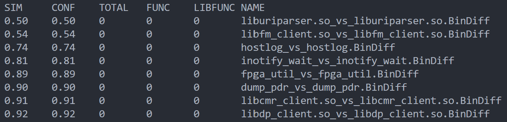

# Batch-IDA


A python library for generate ida pro files in batch mode & compare executable files use bindiff in batch mode.


## Features

1. Fast generate idb/i64 files from binary files in batch mode (Multiprocess supported)
    
2. IDA Pro Plugin Script support
3. Use Bindiff for batch comparison of idb files
4. Roughly read the comparison results
   

## Requirements

+ Windows / macOS / Linux / Linux (wine)
+ IDA pro 7.7/8.3/9.1
+ BinDiff 7/8 (Optional, used to compare executable files in batch mode)

## Install

```
pip install --upgrade batch-ida
```

## Usage

### BI_IDA

Generate .idb/.i64 files (and run plugin) in batch mode.

```python
from batch_ida import BI_IDA


# create a BI_IDA object with ida pro path
bi = BI_IDA('C:\Tools\IDA Pro')
# if you use wine in linux, you can set use_wine=True
# bi = BI_IDA('\home\Tools\IDA Pro', use_wine=True)

# optional
# bi.set_script(r'.\example_script.py')   # run IDA script
# bi.max_subprocess = 8                   # set max subprocess

bi.batch_idb_fromdir('your/binary/files/dir')   # generate idb files from binary files
```


### BI_Dircmp

Compare files in dir_a & dir_b, and move different files to dst_a & dst_b.

```python
from batch_ida import BI_Dircmp


dir_a = r'ver_A.rom/squashfs-root/usr/lib/'
dir_b = r'ver_B.rom/squashfs-root/usr/lib/'

dst_a = r'compare/ver_A'
dst_b = r'compare/ver_B'

bid = BI_Dircmp(dir_a, dir_b, dst_a, dst_b)
bid.cmp()
```

### BI_Bindiff

Generate .idb and .bindiff files in batch mode. (Windows only)

```python
from batch_ida import BI_Bindiff


bib = BI_Bindiff()

# Set ida pro and bindiff path
bib.set_ida_path('C:\Tools\IDA Pro')
bib.set_bindiff_path('C:\Program Files\BinDiff')

dst_a = r'compare/ver_A'
dst_b = r'compare/ver_B'
# dst_a and dst_b are the directories where the binary files to be compared are located
output = bib.batch_bindiff(dst_a, dst_b)
# output is a directory containing bindiff files(sqlite3)
```

### BI_Analyzer

Analyze Bindiff files (sqlite3 file format) in batch mode and print the results.

```python
from batch_ida import BI_Analyzer


bia = BI_Analyzer(r'path\to\output_dir')
bia.print_base_info()

# let's print the diff files with similarity < 0.95 and != 0.0
print("%s\t%s\t%s\t%s\t%s\t%s" % ("SIM", "CONF", "TOTAL", "FUNC", "LIBFUNC", "NAME"))
info_list = bia.get_info_list()
for i in info_list:
    if i['total_func'] & i['func_dif'] & i['libfunc_dif']:
        print("%.02f\t%.2f\t%d\t%d\t%d\t%s" % (i['similarity'], i['confidence'], i['total_func'], i['func_dif'], i[
            "libfunc_dif"], i['name']))
    elif i['similarity'] < 0.95 and i['similarity'] != 0.0:
        print("%.02f\t%.2f\t%d\t%d\t%d\t%s" % (i['similarity'], i['confidence'], i['total_func'], i['func_dif'], i[
            "libfunc_dif"], i['name']))
```
